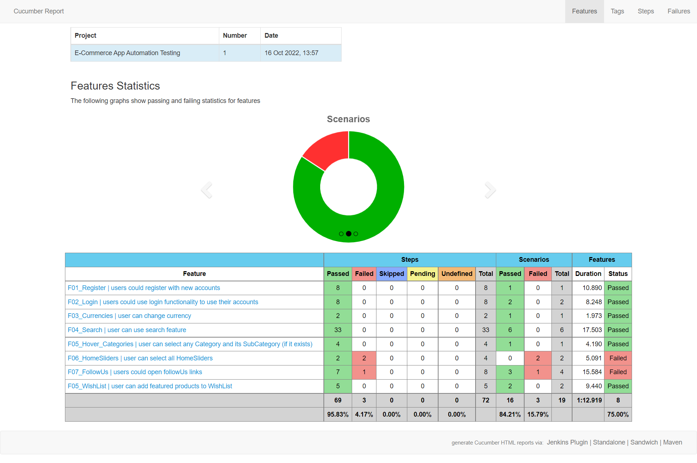

# E-commerce App Frontend Test Automation
This is a project made to pass the eg-fwd Frontend Testing ND

Made with Java progrmming Language, Selenium, TestNG and Cucumber Reporting tool.

This program tests ALL FUNCTIONAL FEATURES of the website "https://www.nopcommerce.com/en"

Then tests results are generated in a neat report using Cucumber.
 
<b>Test Results:</b>

<b>Usage:</b>

    1- install maven through cmd
		
    2- Click on Run_Tests.sh" file
	
Note: You can see all generated reports in "\NEW_E_COMMERCE\target\cucumber-html-reports"
